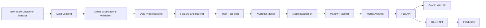

<div align="center">

# 🚀 Customer Churn Prediction System

### End-to-End Machine Learning Pipeline for Telecom Customer Churn Prediction

<p align="center">


</p>

---

### 🎯 Predict Telecom Customer Churn using Machine Learning with an End-to-End Production Pipeline

**Built using XGBoost • MLflow • FastAPI • Gradio • Docker • AWS ECS**

</div>

---

# 📖 Overview

Customer churn is one of the biggest challenges in the telecom industry. Retaining an existing customer is significantly more cost-effective than acquiring a new one.

This project provides a **production-ready Machine Learning system** that predicts whether a telecom customer is likely to churn based on customer demographics, account information, billing details, and subscribed services.

Unlike a traditional notebook-based machine learning project, this repository demonstrates a complete ML lifecycle—from raw data ingestion to model deployment—making it suitable for learning, portfolio presentation, and real-world implementation.

---

# 🎯 Problem Statement

Telecommunication companies lose significant revenue when customers discontinue their services.

The objective of this project is to:

- Predict customers likely to churn.
- Help businesses take proactive retention actions.
- Automate the entire ML workflow.
- Deploy the trained model through REST APIs and an interactive web interface.

---

# ✨ Features

## 📊 Data Pipeline

- Data Loading
- Data Validation using Great Expectations
- Data Preprocessing
- Missing Value Handling
- Feature Engineering
- One-Hot Encoding
- Binary Encoding

---

## 🤖 Machine Learning

- XGBoost Classifier
- Class Imbalance Handling
- Train/Test Split
- Performance Evaluation
- Hyperparameter Configuration
- Model Serialization

---

## 📈 Experiment Tracking

- MLflow Experiment Tracking
- Model Versioning
- Metrics Logging
- Artifact Logging

---

## 🌐 Deployment

- FastAPI REST API
- Interactive Gradio Interface
- Docker Containerization
- AWS ECS Deployment
- Application Load Balancer Support

---

# 🛠 Tech Stack

| Category | Technologies |
|-----------|--------------|
| Programming | Python 3.11 |
| Machine Learning | XGBoost, Scikit-learn |
| Data Processing | Pandas, NumPy |
| Validation | Great Expectations |
| Experiment Tracking | MLflow |
| API | FastAPI |
| User Interface | Gradio |
| Containerization | Docker |
| Cloud | AWS ECS, ALB |
| Version Control | Git & GitHub |

---

# 📊 Model Performance

The model was trained on the **IBM Telco Customer Churn Dataset** using **XGBoost**.

| Metric | Score |
|--------|-------:|
| Accuracy | **72.4%** |
| Precision | **48.8%** |
| Recall | **83.2%** |
| F1 Score | **61.5%** |
| ROC-AUC | **83.9%** |

---

# ⚡ Performance

| Metric | Value |
|---------|-------|
| Training Time | **0.57 sec** |
| Prediction Time | **0.012 sec** |
| Samples / Second | **114,562** |

---

# 📌 Key Highlights

✅ End-to-End Machine Learning Pipeline

✅ Production Ready FastAPI Backend

✅ Interactive Gradio Dashboard

✅ MLflow Experiment Tracking

✅ Dockerized Deployment

✅ AWS ECS Compatible

✅ Feature Engineering Pipeline

✅ Data Validation using Great Expectations

✅ REST API for Predictions

✅ Modular Project Structure

---

---

# 🏗️ System Architecture



---

# 🧠 Machine Learning Pipeline

The project follows a complete production-ready machine learning workflow.

```text
Raw Dataset
     │
     ▼
Load Data
     │
     ▼
Data Validation
(Great Expectations)
     │
     ▼
Data Cleaning
     │
     ▼
Feature Engineering
     │
     ▼
Train/Test Split
     │
     ▼
XGBoost Training
     │
     ▼
Model Evaluation
     │
     ▼
MLflow Logging
     │
     ▼
Save Model
     │
     ▼
FastAPI
     │
     ▼
Gradio Interface
```

---

# ⚙️ End-to-End Workflow

### 1️⃣ Data Loading

The raw customer dataset is loaded using a dedicated data loader module.

✔ CSV Loading

✔ Error Handling

✔ Schema Validation

---

### 2️⃣ Data Validation

Before training, the dataset is validated using **Great Expectations**.

Validation checks include:

- Required Columns
- Missing Values
- Data Types
- Numeric Ranges
- Business Rules
- Statistical Properties
- Dataset Consistency

---

### 3️⃣ Data Preprocessing

The preprocessing pipeline performs:

- Missing Value Handling
- Duplicate Removal
- Data Cleaning
- Data Type Conversion
- TotalCharges Conversion
- Invalid Record Removal

---

### 4️⃣ Feature Engineering

The project automatically generates machine-learning-ready features.

Feature Engineering includes:

- Binary Encoding
- One-Hot Encoding
- Boolean Conversion
- Feature Alignment
- Training-Serving Consistency

Final Features Generated:

**30 Model Features**

---

### 5️⃣ Model Training

Algorithm Used

> XGBoost Classifier

Training includes:

- Class Weight Balancing
- Hyperparameter Configuration
- Train/Test Split
- Model Optimization

---

### 6️⃣ Model Evaluation

The model is evaluated using multiple metrics.

- Accuracy
- Precision
- Recall
- F1 Score
- ROC-AUC

A complete Classification Report is generated after every training run.

---

### 7️⃣ Experiment Tracking

Every training run is automatically logged to MLflow.

Tracked Information:

- Parameters
- Metrics
- Training Time
- Artifacts
- Models

This enables experiment comparison and reproducibility.

---

### 8️⃣ Model Deployment

The trained model is deployed through:

- FastAPI REST API
- Gradio Interface
- Docker Container
- AWS ECS

---

# 📂 Project Structure

```
Customer-Churn-ML
│
├── .github/
│
├── notebooks/
│
├── scripts/
│   └── run_pipeline.py
│
├── src/
│   ├── app/
│   ├── data/
│   ├── features/
│   ├── models/
│   ├── serving/
│   └── utils/
│
├── data/
│   └── raw/
│
├── mlruns/
│
├── dockerfile
│
├── requirements.txt
│
└── README.md
```

---

# 📊 Dataset

Dataset Used

**IBM Telco Customer Churn Dataset**

The dataset contains customer information collected from a telecom company.

## Features Include

- Gender
- Senior Citizen
- Partner
- Dependents
- Tenure
- Phone Service
- Multiple Lines
- Internet Service
- Online Security
- Online Backup
- Device Protection
- Tech Support
- Streaming TV
- Streaming Movies
- Contract
- Paperless Billing
- Payment Method
- Monthly Charges
- Total Charges

Target Variable

```
Churn
```

Binary Classification

- Yes
- No

---

# 🎯 Business Objective

The goal of this project is to identify customers likely to discontinue their telecom service.

By accurately predicting churn, businesses can:

- Improve customer retention
- Reduce revenue loss
- Launch targeted marketing campaigns
- Increase customer lifetime value
- Reduce acquisition costs

---

# 🏆 Why XGBoost?

XGBoost was selected because it offers:

- High predictive performance
- Handles tabular data exceptionally well
- Robust to missing values
- Fast training
- Excellent scalability
- Feature importance support

For customer churn prediction, XGBoost consistently outperforms many traditional classification algorithms.
